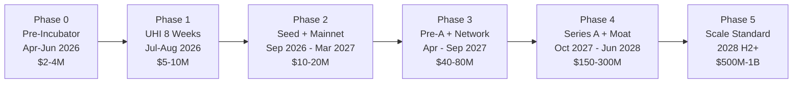

# ILAL 对标 Visa 全阶段战略路线图

## 当前起点快照（2026.3.29）

- **产品状态**: Security-hardened MVP, Base Sepolia testnet
- **合约**: ComplianceHook + SessionManager + Registry + SwapRouter + PlonkVerifier，全部已部署并验证
- **测试**: 219 Solidity + 106 API + 20 Frontend + 15-step E2E，10/10 攻击向量全部拦截
- **链上证明**: [Lifecycle Simulation Report](docs/testing/LIFECYCLE_SIMULATION_REPORT.md) -- 27 笔链上交易，PERFECT 评分
- **在线服务**: ilal.tech (Vercel) + API (Railway)，均连接 Base Sepolia
- **未完成**: 主网部署、真实 KYC 对接、计费系统、多链支持
- **关键事件**: 已入选 Uniswap Hook Incubator (UHI)，2026 年 7 月开始，为期 8 周

---

## 阶段总览




---

## Phase 0: 备战期（2026.4 -- 2026.6）

**战略目标**: 以 Cohort 中技术最完备的项目身份进入 UHI，第一天就震住导师。

### 需要完成的事

**技术层（4 月）**


| 任务                                 | 具体内容                                                                                | 交付物                   | 为什么                 |
| ---------------------------------- | ----------------------------------------------------------------------------------- | --------------------- | ------------------- |
| 部署 isIdentityRouter 到 Base Sepolia | 将二层路由 ACL 升级推送到 Registry UUPS 代理                                                    | Basescan 验证链接         | 进 UHI 前消除唯一的链上功能缺口  |
| CLI 一键 Demo 工具                     | 将 `scripts/full-lifecycle-simulation.ts` 封装成 `npx ilal-demo --network base-sepolia` | 可执行的 npm 包            | 导师/评委可以自己跑，无需你在场    |
| SDK 极简化                            | 确保 `@ilal/sdk` 的 createSession + swap 3 行代码完成                                       | SDK README + 3 个可运行示例 | 开发者体验是 UHI 核心评判标准   |
| 补齐 Billing 骨架                      | 将 billing placeholder 对接 Stripe（至少能走通测试模式的 checkout）                                | Stripe test-mode 链接   | 证明你有变现路径，不只是技术 demo |


**叙事层（5 月）**


| 任务           | 具体内容                                                                       | 交付物              | 为什么                       |
| ------------ | -------------------------------------------------------------------------- | ---------------- | ------------------------- |
| 3 篇技术博客      | (1) ZK Session vs 逐笔验证的效率对比 (2) Uniswap v4 合规 Hook 实战 (3) 机构为什么需要 DeFi 合规层 | Medium/Mirror 发布 | 建立 "合规 DeFi = ILAL" 的搜索权重 |
| 2 分钟 Demo 视频 | 机构注册 -> ZK 证明 -> 合规交易 -> 攻击拦截全流程                                           | YouTube + MP4    | UHI 申请材料 + Demo Day 备用    |
| 5 份用户访谈      | 目标：新加坡/香港中型加密基金 (AUM $50M-$500M)、RWA 项目方、加密做市商                             | 访谈记录 + 需求清单      | 带着真实需求进 UHI，不是带假设         |


**关系层（6 月）**


| 任务                             | 具体内容                                                                   | 交付物        | 为什么          |
| ------------------------------ | ---------------------------------------------------------------------- | ---------- | ------------ |
| 联系 Uniswap Foundation Grant 团队 | 发邮件介绍 ILAL + 预沟通 UHI 期间的计划                                             | 邮件记录       | 进去后不是陌生人     |
| 准备入营材料                         | 5 页技术白皮书 + 架构图 + 竞品分析（Chainalysis Compliance、Elliptic、Violet Protocol） | PDF/Notion | 第一印象决定后续资源分配 |
| 模拟 Pitch x3                    | 找 2-3 个业内朋友做模拟评审                                                       | 反馈清单       | 发现盲区         |


### 进入 Phase 1 的门槛条件

```
 ALL of the following must be true:
 [x] isIdentityRouter 已部署到 Base Sepolia 代理合约
 [x] npx ilal-demo --network base-sepolia 可一键跑通
 [x] SDK 3 行代码 demo 可运行
 [x] 至少 3 篇技术博客已发布
 [x] Demo 视频完成
 [x] 至少 3 份用户访谈记录
 [x] 5 页白皮书定稿
 [x] Pitch 至少模拟 3 次
```

### 估值锚点: $2M -- $4M pre-money

- **依据**: 有完整的链上可验证 MVP + 入选 UHI + 无收入 + 单人/小团队
- **对标**: 同期 crypto infra 项目 pre-incubator 估值（Harbor pre-seed $1.5M，Levery angel round）
- **此阶段不融资**，估值仅作内部锚定

---

## Phase 1: UHI 孵化期（2026.7.1 -- 2026.8.26，8 周）

**战略目标**: 赢得 Demo Day 奖项 + 获得种子轮 Term Sheet + 被 Uniswap 官方引用

### 周级作战计划

**Week 1-2: 侦察 + 占位**


| 天    | 核心动作                                      | 目的             |
| ---- | ----------------------------------------- | -------------- |
| W1D1 | 开营：用一句话定位 "ILAL = Uniswap v4 的 Visa 合规网络" | 建立认知锚点         |
| W1D2 | 列出 Cohort 所有项目，标记合作/竞争关系                  | 战场地图           |
| W1D3 | Workshop 后找 Tom Wade 1:1，问 Demo Day 评判标准  | 逆向工程评分         |
| W1D4 | 预约 Uniswap Labs 工程师 office hours          | 技术认可           |
| W1D5 | 在 Discord #hooks 回答合规相关问题                 | 占领话语权          |
| W2D1 | Uniswap Foundation 工程师 1:1：展示合约+测试报告      | 震住技术团队         |
| W2D2 | 问："ILAL 成为 Uniswap 官方推荐合规 Hook 的条件是什么？"   | 获得明确 checklist |
| W2D3 | 联系 Cohort 中的 RWA 项目，提议联合 Demo             | 生态协同           |
| W2D4 | 叙事 V0 给 Tom Wade 审阅                       | 早反馈            |
| W2D5 | 第一次完整版 weekly update 提交                   | 建立纪律           |


**Week 3-4: 主网部署 + VC 导师**


| 任务                                     | 内容                                                                                  | 产出                     |
| -------------------------------------- | ----------------------------------------------------------------------------------- | ---------------------- |
| 主网部署                                   | ComplianceHook, SessionManager, Registry, PlonkVerifier, SwapRouter -> Base Mainnet | Basescan 验证 + 所有合约地址   |
| 首笔主网交易                                 | 用自己的测试资产创建合规池 + 执行交易                                                                | 主网交易哈希 = Demo Day 最强弹药 |
| 主网 Lifecycle Demo                      | 简化版 full-lifecycle-simulation 跑主网                                                   | 主网报告                   |
| VC 导师 1:1 (a16z / Dragonfly / Variant) | 不 pitch 融资，问 "机构 DeFi 合规赛道最大风险？"                                                    | 反向获取投资逻辑               |
| Pitch Deck V1                          | 基于 VC 反馈调整叙事                                                                        | 10 页 deck              |


**Week 5-6: Pitch 打磨 + Grant 申请**


| 任务                   | 内容                                                                         | 产出         |
| -------------------- | -------------------------------------------------------------------------- | ---------- |
| Pitch Deck V2 (10 页) | 问题 -> 后果 -> 方案 -> Live Demo -> 护城河 -> TAM -> 商业模式 -> Traction -> 团队 -> Ask | 终稿         |
| Mock Pitch x5        | 和 Cohort 同学互相练                                                             | 时间控制在 5 分钟 |
| Tom Wade 终审          | 让他看完整 pitch，问 "如果你是评委，为什么不投？"                                              | 最后一次大改     |
| 申请材料准备               | Uniswap Foundation grant + HPA (Hook Product Accelerator) + 审计补贴           | 3 份申请文档    |


**Week 7: Demo Day 冲刺**

5 分钟分配:

- 0:00-0:30 -- Hook: "每天 $3B 机构资金想进 DeFi，合规官说不行"
- 0:30-1:30 -- 方案: 一张架构图讲清 ZK Session + ComplianceHook
- 1:30-3:30 -- **LIVE DEMO on Base Mainnet**: 合规交易成功 + 攻击被拦截 + Basescan 验证
- 3:30-4:15 -- 商业: Visa 模式 + TAM + Traction
- 4:15-5:00 -- Ask: $1.5M seed, 用途明确

技术彩排: 提前 1 小时发测试交易确认链正常，准备录屏备用

**Week 8: 收割**


| 天           | 核心动作                                                                       |
| ----------- | -------------------------------------------------------------------------- |
| Demo Day 当天 | Twitter thread 总结 + Basescan 链接 + 感谢导师 @Uniswap @UniswapFND @AtriumAcademy |
| +1 天        | 给所有感兴趣的人发 follow-up 邮件（附 deck + demo 链接）                                   |
| +2 天        | 正式提交 Uniswap Foundation grant + HPA 申请                                     |
| +3 天        | 给 a16z / Dragonfly / Variant 评委发正式融资 meeting 请求                            |
| +5 天        | Term sheet 谈判开始（如果一切顺利）                                                    |


### 需要的资源

- Uniswap Labs 技术 review (UHI 提供)
- 安全审计补贴申请 (UHI 提供)
- VC 导师 1:1 access (UHI 提供, a16z / Dragonfly / Variant / USV)
- Base 主网部署 ETH (约 0.1-0.5 ETH, 自备)
- 差旅费（如果 Demo Day 线下）

### 进入 Phase 2 的门槛条件

```
 AT LEAST 3 of the following must be true:
 [ ] Demo Day 获得至少 1 个奖项（Uniswap Prize 最优先）
 [ ] Base 主网合约部署并验证
 [ ] 至少 1 笔主网合规交易完成
 [ ] 获得至少 1 个 VC 的 term sheet 或 strong interest
 [ ] Uniswap 官方（博客/文档/Twitter）至少 1 次正式提及 ILAL
 [ ] 提交 Uniswap Foundation grant 申请
```

### 估值锚点: $5M -- $10M pre-money

- **依据**: UHI 毕业 + Demo Day 奖项 + Base 主网运行 + VC 关注
- **对标**: Harbor ($1.5M pre-seed, 非 Incubator); UHI 校友在 Demo Day 后通常获得 $3-8M 估值
- **溢价因素**: ILAL 是合规赛道（对 VC 来说是 "regulatory moat" 叙事），比纯 DeFi 优化类 Hook 估值更高

---

## Phase 2: 种子轮 + 主网（2026.9 -- 2027.3）

**战略目标**: Close 种子轮 + 获得第一个真实机构客户 + 形成收入

### 6 个月分解

**M1 (Sep)**: 种子轮 Close


| 任务       | 具体                                                            | 门槛           |
| -------- | ------------------------------------------------------------- | ------------ |
| 融资 close | $1.5M-$3M seed round                                          | 领投方确认 + 资金到账 |
| 目标领投     | Uniswap Ventures > a16z Scout > Dragonfly > Coinbase Ventures | 至少 1 家       |
| 估值       | $8M-$15M pre-money                                            | 不低于 $8M      |
| 条款底线     | 不接受超过 2x liquidation preference; 创始人保留 60%+                   | 保护控制权        |


融资用途明细:

- 2 名全栈工程师 (12 个月): $240K
- 1 名 BD/合规负责人 (新加坡): $120K
- 安全审计 (2 次，Trail of Bits / OpenZeppelin 级别): $200K-$400K
- 法律 + 监管咨询 (MAS, VARA): $100K
- 服务器/基础设施: $60K
- 缓冲: 剩余

**M2-M3 (Oct-Nov)**: 主网强化 + 审计


| 任务             | 具体                                                  |
| -------------- | --------------------------------------------------- |
| 独立安全审计 Round 1 | 提交 ComplianceHook + SessionManager + Registry 给审计公司 |
| 主网合约升级流程       | 建立 multisig (Safe) 管理 UUPS 升级权限                     |
| 真实 KYC 对接      | 集成 Sumsub 或 Jumio，替换 Mock 自动审批                      |
| Billing 上线     | Stripe 接入，Free/Pro/Enterprise 三档                    |


**M4-M5 (Dec-Jan)**: 第一个客户


| 目标            | 策略                                                                      |
| ------------- | ----------------------------------------------------------------------- |
| 签约 1 个付费客户    | 优先级: (1) UHI cohort 中的 RWA 项目 (2) Uniswap Foundation 介绍的机构 (3) 用户访谈中的基金 |
| 降低采用门槛        | 前 3 个月免费 + ILAL 帮写集成代码 + 帮出合规文档给客户的审计师                                  |
| 交易里程碑         | 至少 1 笔 > $10K 的主网合规交易                                                   |
| 公开 case study | 与客户联合发布 "如何用 ILAL 实现合规 DeFi"                                            |


**M6 (Feb-Mar)**: 扩客户 + 开始协议集成


| 目标               | 具体                            |
| ---------------- | ----------------------------- |
| 3-5 个机构客户        | 至少 1 个付费（Pro tier $500/month） |
| 月交易量             | $500K-$1M                     |
| Aave/Morpho 初步对接 | 开始和第 2 个 DeFi 协议讨论集成可能性       |
| 审计 Report 发布     | 公开审计报告，建立安全公信力                |


### 收入模型（Phase 2 末）

```
Free tier:        10 sessions/month, 无费用
Pro tier:         $500/month + 0.5 bps on tx volume over $100K
Enterprise tier:  $5,000/month + custom SLA + dedicated support

目标 M6 MRR: $2,500-$5,000
目标 M6 ARR run rate: $30K-$60K
```

### 进入 Phase 3 的门槛条件

```
 ALL of the following:
 [ ] 种子轮 $1.5M+ 到账
 [ ] 至少 1 次独立安全审计完成
 [ ] 真实 KYC 对接上线（非 Mock）
 [ ] Billing 系统可收费
 [ ] 至少 1 个付费机构客户
 [ ] 至少 1 笔 > $10K 主网合规交易
 [ ] MRR > $0（有实际收入）
```

### 估值锚点: $10M -- $20M pre-money

- **依据**: 种子轮 $1.5-3M 进来 @ $8-15M; Phase 2 末如果有客户 + 收入，估值增长 30-50%
- **对标**: Web3 compliance 赛道种子轮 -- Chainalysis (种子轮 $1.6M @ ~$8M, 2014), Elliptic (种子轮 $2M @ ~$10M, 2016)
- **关键增值**: 主网 + 审计 + 第一个客户 = 从"concept"变成"product-market fit signal"

---

## Phase 3: Pre-A + 网络效应（2027.4 -- 2027.9）

**战略目标**: 集成 2-3 个 DeFi 协议 + 覆盖 2-3 条链 + 申请监管 Sandbox

### 6 个月分解

**Q2 2027 (Apr-Jun)**


| 任务              | 目标                                | 为什么关键                       |
| --------------- | --------------------------------- | --------------------------- |
| 第 2 个协议集成       | Aave v4 或 Morpho 的合规借贷池           | 从 "Uniswap 插件" 变成 "多协议基础设施" |
| 跨链部署 V1         | Base + Arbitrum（Uniswap v4 已上线的链） | 证明 "链无关" 架构                 |
| ZK Session 跨链互通 | Base 上的 Session 在 Arbitrum 也认     | 这是替换成本的起点                   |
| 招聘              | +2 工程师 + 1 BD (新加坡)               | 团队从 2-3 人扩到 5-6 人           |


**Q3 2027 (Jul-Sep)**


| 任务                         | 目标                                   | 为什么关键              |
| -------------------------- | ------------------------------------ | ------------------ |
| 第 3 个协议集成                  | Ondo Finance（代币化国债）或 Centrifuge（RWA） | 进入 RWA 赛道 = TAM 翻倍 |
| 新加坡 MAS Fintech Sandbox 申请 | 提交申请 + 进入审批流程                        | 监管认可 = 最深的护城河      |
| 迪拜 VARA 注册                 | 备选监管管辖区                              | 双保险                |
| Pre-A 融资准备                 | 更新 deck + 数据 room + term sheet 草案    | 有数据后融资更有底气         |


### KPI 目标（Phase 3 末）

```
客户数:        15-25 个机构
月交易量:      $5M-$20M
MRR:           $15K-$30K
ARR run rate:  $180K-$360K
协议集成:      3 个 DeFi 协议
链覆盖:        2-3 条 EVM 链
团队:          5-6 人
```

### 进入 Phase 4 的门槛条件

```
 AT LEAST 4 of the following:
 [ ] 3+ 个 DeFi 协议集成
 [ ] 2+ 条链覆盖
 [ ] 月交易量 > $5M
 [ ] MRR > $10K
 [ ] MAS 或 VARA sandbox 申请已提交
 [ ] 至少 1 个协议方公开推荐 ILAL
 [ ] 审计报告 v2 完成
 [ ] 客户数 > 10
```

### 估值锚点: $40M -- $80M pre-money

- **依据**: 多协议集成 + 跨链 + 真实收入 + 监管 pipeline
- **对标**: Chainalysis Series A ($6M @ ~$40M, 2017), Elliptic Series A ($5M @ ~$30M, 2017); 但 2027 加密市场更大
- **溢价因素**: DeFi 原生 + ZK 技术壁垒 + Uniswap 生态背书

---

## Phase 4: Series A + 监管护城河（2027.10 -- 2028.6）

**战略目标**: 获得监管认可 + 成为 Uniswap 生态默认合规层 + 团队扩展

### 9 个月分解

**Q4 2027 (Oct-Dec)**


| 里程碑            | 内容                                                            |
| -------------- | ------------------------------------------------------------- |
| Series A close | $10M-$20M @ $150M-$300M pre-money                             |
| 领投候选           | a16z Crypto (主力), Paradigm, Dragonfly (亚太), Coinbase Ventures |
| MAS Sandbox 获批 | 正式认可函 = "ILAL ZK Session 被新加坡监管认可"                            |
| ILAL 认证计划      | 推出 "ILAL Verified" 标识，机构付费获取                                  |


**Q1-Q2 2028 (Jan-Jun)**


| 里程碑            | 内容                                                  |
| -------------- | --------------------------------------------------- |
| 欧洲 MiCA 注册     | 进军欧洲市场                                              |
| 5+ 协议集成        | Uniswap, Aave, Morpho, Ondo, + 1 新兴协议               |
| 5+ 链覆盖         | Base, Arbitrum, Optimism, Ethereum mainnet, Polygon |
| ZK 身份互操作       | 接入 Coinbase Verifications / Polygon ID / EAS        |
| Uniswap 官方合规标准 | ILAL 模式写入 Uniswap v4 开发文档                           |


### KPI 目标（Phase 4 末）

```
客户数:        100+ 机构
月交易量:      $100M-$500M
MRR:           $150K-$400K
ARR:           $1.8M-$5M
协议集成:      5+ 个 DeFi 协议
链覆盖:        5+ 条链
团队:          15-20 人
监管认可:      2+ 个辖区（MAS + VARA/MiCA）
```

### 进入 Phase 5 的门槛条件

```
 ALL of the following:
 [ ] Series A closed ($10M+)
 [ ] 至少 1 个监管辖区正式认可
 [ ] 月交易量 > $100M
 [ ] ARR > $1M
 [ ] 5+ 协议集成
 [ ] 5+ 链覆盖
 [ ] "ILAL Verified" 标识被至少 10 个机构使用
 [ ] ZK Session 跨链互通生产可用
```

### 估值锚点: $150M -- $300M pre-money

- **依据**: Series A @ 20-30x ARR (crypto infra 标准倍数)
- **对标**: Chainalysis Series B ($16M @ $180M, 2019); 考虑到 DeFi 赛道比链上分析更大
- **关键溢价**: 监管认可是极其稀缺的资产，每增加一个辖区认可，估值增加 30-50%

---

## Phase 5: 规模化 -- 成为行业标准（2028 H2+）

**战略目标**: 让 "用 ILAL" 像 "接入 Visa 网络" 一样成为机构默认行为

### 核心里程碑


| 时间      | 里程碑                             | 估值影响                 |
| ------- | ------------------------------- | -------------------- |
| 2028 Q3 | 月交易量 $1B+, ARR $10M+            | 证明 PMF + scalability |
| 2028 Q4 | Series B: $50M-$80M @ $500M-$1B | 进入独角兽候选              |
| 2029    | 覆盖 10+ 链, 20+ 协议, 500+ 机构客户     | 网络效应不可逆              |
| 2029    | 美国 SEC 相关申请 / 合规框架参与            | 进入最大市场               |
| 2030    | 年交易量 $50B+, ARR $50M+           | Visa 级别基础设施地位        |
| 2030+   | IPO 或 Protocol Token 发行         | $2B-$5B+             |


### 长期收入模型（Visa 模式）

```
Visa 收入结构:                     ILAL 对应:
─────────────                      ─────────
服务收入 (Service Revenue)          协议集成基础费
数据处理收入 (Data Processing)      交易量抽成 (0.5-1 bps)
国际交易收入 (International)        跨链交易溢价
其他 (Other: Token, licensing)     ZK Session NFT / Compliance API licensing

Visa: ~$30B 年收入，$500B 市值，~17x revenue
ILAL 2030 目标: $50M ARR -> 如果达到 Visa 级别网络效应 -> 30-50x revenue -> $1.5B-$2.5B
```

---

## 关键风险 + 对策


| 风险                | 概率  | 影响  | 对策                                       |
| ----------------- | --- | --- | ---------------------------------------- |
| Uniswap 自己做合规层    | 低   | 致命  | 通过 UHI 建立深度合作关系，让 ILAL 成为他们推荐的方案而非竞争对手   |
| 监管突然收紧（全面禁止 DeFi） | 低   | 高   | 多辖区布局，如果一个国家禁止，其他国家仍可运营                  |
| 竞争对手抄袭            | 中   | 中   | ZK 电路 + 合约审计 + 监管关系 + 网络效应 = 6-12 个月领先优势 |
| 机构采用比预期慢          | 中   | 中   | 保持低 burn rate，延长 runway 到 24 个月          |
| ZK 技术被更好方案替代      | 低   | 中   | 模块化设计，验证层可替换（PLONK -> Halo2 -> 未来方案）     |
| 团队流失              | 中   | 中   | 有竞争力的 equity + 远程工作 + 使命驱动               |


---

## 从 Phase 0 开始的第一个动作

当前 (2026.3.29) 距离 UHI 开营 (2026.7.1) 还有 **93 天**。

最优先的 3 件事:

1. **将 isIdentityRouter 升级部署到 Base Sepolia UUPS 代理** -- 消除唯一链上功能缺口
2. **封装 CLI demo 工具** (`npx ilal-demo`) -- 让任何人 1 分钟内体验 ILAL
3. **写第一篇技术博客** (ZK Session vs 逐笔验证) -- 开始建立内容资产

