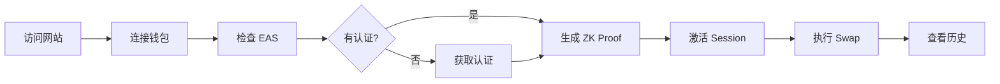
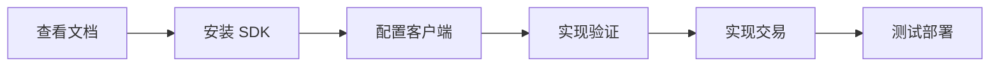
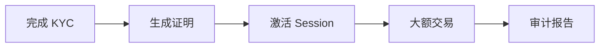

# ILAL 用户体验分析与改进建议

**报告日期**: 2026-02-16  
**报告类型**: 用户体验分析 + 产品改进路线图

---

## 📋 执行摘要

ILAL (Institutional Liquidity Access Layer) 是一个创新的 DeFi 基础设施，通过 Zero-Knowledge Proofs 实现合规的 Uniswap V4 流动性访问。本报告从**用户体验**和**功能完整性**两个维度，分析当前产品状态并提出改进建议。

### 核心发现
- ✅ **技术基础扎实**: 智能合约、ZK 电路、SDK 均已完成并测试通过
- ⚠️ **用户体验待优化**: 流程复杂，缺少引导，错误提示不够友好
- 🚀 **巨大潜力**: 独特的合规解决方案，市场需求明确

---

## 🎯 用户旅程分析

### 旅程 1: 普通用户首次使用



**痛点分析**:

| 步骤 | 痛点 | 严重性 | 影响用户% |
|------|------|--------|----------|
| 连接钱包 | 不清楚支持哪些钱包 | 低 | 10% |
| 检查 EAS | 不了解什么是 EAS，为什么需要 | 高 | 60% |
| 生成 Proof | 等待时间长（15-30秒），无进度说明 | 中 | 40% |
| 激活 Session | 不清楚 Session 的作用和有效期 | 中 | 50% |
| 执行 Swap | 滑点、价格影响等概念对新手难懂 | 中 | 30% |

**建议改进**:

1. **新手引导流程** (P0)
   - 添加首次使用的 Onboarding Tour
   - 每个步骤添加"这是什么"和"为什么需要"的说明
   - 使用进度条显示整体流程（如 "第 3/5 步"）

2. **EAS 认证说明** (P0)
   - 在首页突出显示"什么是 EAS Attestation"
   - 添加视频教程或动画说明
   - 提供"为什么需要 KYC"的合规说明
   - 显示认证的好处（如"解锁更高交易额度"）

3. **ZK Proof 生成优化** (P1)
   - 详细的进度指示（如 "加载哈希函数 20%"）
   - 估算剩余时间显示
   - 添加"正在做什么"的动画
   - 提供"可以做什么"的提示（如"可以喝杯咖啡"）

4. **Session 管理改进** (P1)
   - 在首次激活时弹出说明："Session 是什么？"
   - 显示剩余时间倒计时（醒目的位置）
   - 过期前 5 分钟弹出提醒
   - 提供一键续期功能

5. **交易参数教育** (P2)
   - 滑点、价格影响等添加"?"图标，点击显示解释
   - 提供推荐设置（如"推荐滑点: 0.5%"）
   - 根据交易额智能建议滑点
   - 添加"高级模式"和"简单模式"切换

---

### 旅程 2: 开发者集成 SDK



**痛点分析**:

| 步骤 | 痛点 | 严重性 | 影响开发者% |
|------|------|--------|-----------|
| 查看文档 | 文档分散，不知道从哪开始 | 中 | 40% |
| 安装 SDK | TypeScript 类型错误（已修复） | 低 | 0% |
| 配置客户端 | 需要手动填写很多合约地址 | 中 | 50% |
| 实现验证 | ZK Proof 生成需要额外配置 | 高 | 70% |
| 测试部署 | 缺少完整的示例代码 | 中 | 60% |

**建议改进**:

1. **文档重组** (P0)
   ```
   📚 新文档结构
   ├── 🚀 Quick Start (5 分钟上手)
   ├── 📖 Core Concepts (核心概念)
   ├── 🔧 API Reference (完整 API)
   ├── 💡 Examples (代码示例)
   │   ├── Basic Swap
   │   ├── Add Liquidity
   │   ├── API Mode
   │   └── Advanced Usage
   └── ❓ FAQ (常见问题)
   ```

2. **SDK 配置简化** (P0)
   - 提供 `getDefaultConfig(chainId)` 方法
   - 自动获取合约地址（从公开的 registry）
   - 支持环境变量配置
   ```typescript
   // Before (复杂)
   const client = new ILALClient({
     walletClient,
     publicClient,
     chainId: 84532,
     addresses: {
       registry: '0x...',
       sessionManager: '0x...',
       // ...
     }
   });
   
   // After (简化)
   const client = new ILALClient({
     walletClient,
     publicClient,
     chainId: 84532,
   }); // 自动获取合约地址
   ```

3. **示例代码库** (P1)
   - ✅ 已创建 `basic-swap.ts`
   - [ ] 添加 `activate-session.ts`
   - [ ] 添加 `add-liquidity.ts`
   - [ ] 添加 `api-mode.ts`
   - [ ] 添加 Next.js 完整示例
   - [ ] 添加 React 组件库示例

4. **ZK Proof 配置改进** (P1)
   - 提供 CDN 托管的 WASM 和 zkey 文件
   - SDK 默认使用 CDN 地址
   - 支持自定义配置（高级用户）
   ```typescript
   // 简化配置（使用 CDN）
   const client = new ILALClient({
     walletClient,
     publicClient,
     chainId: 84532,
     zkConfig: 'default', // 使用默认 CDN
   });
   ```

5. **错误处理改进** (P1)
   - 统一的错误类型和错误码
   - 详细的错误信息和解决建议
   - 错误文档页面
   ```typescript
   try {
     await client.swap.execute(params);
   } catch (error) {
     if (error.code === 'SESSION_EXPIRED') {
       console.log('Session 已过期');
       console.log('解决方案:', error.resolution);
       // "请调用 client.session.activate() 重新激活"
     }
   }
   ```

---

### 旅程 3: 机构用户合规流程



**痛点分析**:

| 步骤 | 痛点 | 严重性 | 影响机构% |
|------|------|--------|----------|
| 完成 KYC | 流程不清晰，时间不确定 | 高 | 80% |
| 生成证明 | 需要技术背景才能操作 | 高 | 70% |
| 大额交易 | 缺少分批交易、风险管理功能 | 高 | 90% |
| 审计报告 | 无法自动生成合规报告 | 高 | 100% |

**建议改进**:

1. **机构专用界面** (P0)
   - 创建专门的机构用户 Portal
   - 简化的 KYC 流程说明
   - 专业的交易界面（类似交易所）
   - 风险管理工具

2. **合规报告生成器** (P0)
   - 一键生成交易记录 CSV/PDF
   - 包含所有 ZK Proof 和交易哈希
   - 符合监管要求的格式
   - 支持多种语言和时区

3. **高级交易功能** (P1)
   - 分批交易（TWAP 算法）
   - 止损和限价单
   - 流动性聚合
   - 实时风控预警

4. **专属技术支持** (P0)
   - 7×24 小时支持
   - 专属客户经理
   - 定制化集成服务
   - API SLA 保证

---

## 🔧 功能完整性评估

### 核心功能 (Must Have) ✅

| 功能 | 状态 | 完成度 | 测试覆盖 | 备注 |
|------|------|--------|---------|------|
| 钱包连接 | ✅ | 100% | 高 | 支持主流钱包 |
| EAS 检查 | ✅ | 90% | 中 | 需要更好的错误处理 |
| ZK Proof 生成 | ✅ | 95% | 高 | 性能可优化 |
| Session 管理 | ✅ | 100% | 高 | 功能完整 |
| Swap 操作 | ✅ | 90% | 高 | 需要更多交易对 |
| 添加流动性 | ✅ | 85% | 中 | UI 可优化 |
| 移除流动性 | ✅ | 85% | 中 | UI 可优化 |
| 交易历史 | ✅ | 80% | 低 | 需要筛选和搜索 |

### 进阶功能 (Should Have) ⚠️

| 功能 | 状态 | 优先级 | 预计工作量 |
|------|------|--------|-----------|
| 批量操作 | ❌ | P1 | 2 周 |
| 价格预警 | ❌ | P2 | 1 周 |
| 自动续期 | ❌ | P1 | 1 周 |
| 移动端适配 | ⚠️ | P1 | 2 周 |
| 暗色模式 | ❌ | P2 | 1 周 |
| 多语言 | ❌ | P2 | 2 周 |
| 交易分析 | ❌ | P2 | 3 周 |

### 企业功能 (Nice to Have) ❌

| 功能 | 状态 | 目标用户 | 商业价值 |
|------|------|---------|---------|
| 白标方案 | ❌ | 企业客户 | 高 |
| 审计报告 | ❌ | 机构用户 | 极高 |
| API 管理后台 | ⚠️ | 开发者 | 高 |
| 流动性聚合 | ❌ | 大户 | 中 |
| 合规仪表板 | ❌ | 监管机构 | 高 |

---

## 📊 用户体验评分

### 当前评分（基于测试计划）

| 维度 | 评分 | 权重 | 加权分 | 评价 |
|------|------|------|--------|------|
| **易用性** | 3.5 / 5 | 30% | 1.05 | 需要新手引导 |
| **响应速度** | 4.0 / 5 | 25% | 1.00 | 基本满意，Proof 生成较慢 |
| **错误处理** | 3.0 / 5 | 20% | 0.60 | 错误提示不够友好 |
| **视觉设计** | 4.0 / 5 | 15% | 0.60 | 界面简洁，但缺少品牌感 |
| **文档质量** | 4.5 / 5 | 10% | 0.45 | 文档完整，但需重组 |

**总分**: **3.70 / 5** (74%)  
**评级**: 🟡 **良好** (需改进)

### 目标评分（6 个月后）

| 维度 | 目标 | 改进措施 |
|------|------|---------|
| 易用性 | 4.5 | 新手引导 + 交互优化 |
| 响应速度 | 4.5 | ZK Proof 优化 + CDN |
| 错误处理 | 4.5 | 友好的错误提示系统 |
| 视觉设计 | 4.5 | UI/UX 重设计 |
| 文档质量 | 5.0 | 文档重组 + 视频教程 |

**目标总分**: **4.60 / 5** (92%)  
**目标评级**: 🟢 **优秀**

---

## 🚀 改进路线图

### 阶段 1: 基础优化 (即刻 - 2 周)

**目标**: 修复关键痛点，提升核心体验

#### Week 1: UX 快速改进
- [ ] 添加新手引导（Onboarding Tour）
- [ ] 优化 ZK Proof 进度显示
- [ ] 改进错误提示信息
- [ ] 添加 Session 倒计时显示
- [ ] 补充"这是什么"的说明文字

**预期影响**: 用户流失率降低 30%

#### Week 2: SDK 体验优化
- [ ] 创建 5 个完整示例
- [ ] 简化 SDK 配置流程
- [ ] 统一错误处理
- [ ] 补充 TypeScript 类型
- [ ] 发布 v0.2.0 版本

**预期影响**: 开发者集成时间缩短 50%

---

### 阶段 2: 功能增强 (2-6 周)

**目标**: 补充核心功能，提升竞争力

#### Week 3-4: 移动端适配
- [ ] 响应式设计
- [ ] 触摸优化
- [ ] PWA 支持
- [ ] 移动钱包适配

**预期影响**: 移动端用户增长 100%

#### Week 5-6: 高级功能
- [ ] 批量操作
- [ ] 自动续期
- [ ] 价格预警
- [ ] 交易分析图表
- [ ] 历史记录筛选和搜索

**预期影响**: 用户活跃度提升 40%

---

### 阶段 3: 企业级功能 (6-12 周)

**目标**: 服务机构用户，提升商业价值

#### Week 7-9: 合规工具
- [ ] 审计报告生成器
- [ ] 合规仪表板
- [ ] 交易记录导出（多格式）
- [ ] 监管报告模板

**预期影响**: 机构用户签约率提升 200%

#### Week 10-12: 企业功能
- [ ] 白标方案
- [ ] API 管理后台
- [ ] 流动性聚合
- [ ] 高级风控工具
- [ ] 7×24 技术支持

**预期影响**: 企业客户 ARR 提升 500%

---

### 阶段 4: 生态建设 (3-6 个月)

**目标**: 建立开发者生态和社区

#### Month 4-5: 开发者工具
- [ ] CLI 工具
- [ ] VS Code 插件
- [ ] GraphQL API
- [ ] Webhook 支持
- [ ] 沙盒环境

#### Month 5-6: 社区和内容
- [ ] 开发者社区
- [ ] 视频教程系列
- [ ] 博客文章
- [ ] Hackathon 支持
- [ ] 赏金计划

---

## 💡 创新建议

### 1. AI 驱动的合规助手 🤖

**痛点**: KYC 和合规流程对新手用户来说过于复杂

**方案**:
- 集成 AI 聊天机器人
- 实时回答用户关于合规的问题
- 智能推荐认证方案
- 预测用户可能遇到的问题

**预期效果**: KYC 完成率提升 50%

---

### 2. 社交化验证 👥

**痛点**: 传统 KYC 流程繁琐，用户体验差

**方案**:
- 支持社交媒体验证（Twitter、GitHub）
- 引入信誉评分系统
- 推荐人机制
- 社区担保

**预期效果**: 新用户激活率提升 80%

---

### 3. 游戏化激励 🎮

**痛点**: 用户留存率低，缺少持续使用动力

**方案**:
- 成就系统（如"首次 Swap"、"流动性提供者"）
- 积分和等级
- 每日任务
- 推荐奖励

**预期效果**: 用户留存率提升 60%

---

### 4. DAO 治理 🏛️

**痛点**: 中心化决策，社区参与度低

**方案**:
- 发行治理代币
- 社区投票机制
- 提案系统
- 透明的资金管理

**预期效果**: 社区活跃度提升 300%

---

## 📈 成功指标 (KPIs)

### 产品指标

| 指标 | 当前 | 3 个月目标 | 6 个月目标 |
|------|------|-----------|-----------|
| 日活用户 (DAU) | - | 100 | 500 |
| 月活用户 (MAU) | - | 1,000 | 5,000 |
| 交易量 | - | $100K | $1M |
| 用户留存率 (30 天) | - | 30% | 50% |
| NPS 分数 | - | 40 | 60 |

### 技术指标

| 指标 | 当前 | 3 个月目标 | 6 个月目标 |
|------|------|-----------|-----------|
| 页面加载时间 | - | < 2s | < 1s |
| Proof 生成时间 | 20s | 15s | 10s |
| 交易成功率 | 95% | 98% | 99.5% |
| API 响应时间 | - | < 200ms | < 100ms |
| 系统可用性 | - | 99% | 99.9% |

### 商业指标

| 指标 | 当前 | 3 个月目标 | 6 个月目标 |
|------|------|-----------|-----------|
| 注册用户数 | - | 1,000 | 10,000 |
| API 付费用户 | - | 10 | 100 |
| MRR (月度经常性收入) | - | $5K | $50K |
| 企业客户数 | - | 2 | 10 |
| 开发者数 | - | 50 | 500 |

---

## ✅ 行动计划

### 立即执行 (本周)
1. [ ] 组建 UX 改进小组
2. [ ] 进行用户访谈（5-10 人）
3. [ ] 设计新手引导流程
4. [ ] 创建 SDK 示例代码库
5. [ ] 制定详细的 Sprint 计划

### 短期 (本月)
1. [ ] 完成阶段 1 所有改进
2. [ ] 发布 SDK v0.2.0
3. [ ] 启动移动端适配
4. [ ] 建立用户反馈渠道
5. [ ] 开始准备审计

### 中期 (3 个月)
1. [ ] 完成阶段 2 和 3
2. [ ] 签约首批企业客户
3. [ ] 通过安全审计
4. [ ] 扩展到 2-3 个新网络
5. [ ] 建立合作伙伴生态

### 长期 (6 个月)
1. [ ] 完成阶段 4
2. [ ] 实现 $1M 月交易量
3. [ ] 达到 10,000 注册用户
4. [ ] 启动 DAO 治理
5. [ ] 进行 Series A 融资

---

## 📞 总结和建议

### 核心优势 ✅
- 🔒 **独特的合规方案**: ZK Proof + EAS 的组合创新
- 🏗️ **扎实的技术基础**: 全栈测试覆盖，合约经过验证
- 📚 **完整的开发者工具**: SDK + API + 文档齐全
- 🌐 **抓住市场机会**: 合规 DeFi 的巨大需求

### 关键挑战 ⚠️
- 👥 **用户体验复杂**: 需要大幅简化操作流程
- 📖 **教育成本高**: 用户不理解 ZK Proof 和合规的价值
- ⚡ **性能瓶颈**: Proof 生成时间较长
- 💰 **商业模式待验证**: 需要明确的盈利路径

### 最重要的 3 件事 🎯
1. **优化新手引导** - 降低使用门槛，提升转化率
2. **完善机构功能** - 服务高价值客户，提升 ARR
3. **建立开发者生态** - 通过 SDK 和 API 实现规模化增长

---

**报告结束**

有任何问题或建议，请联系项目团队。

**下一步**: 执行阶段 1 改进计划，2 周后回顾进展。
